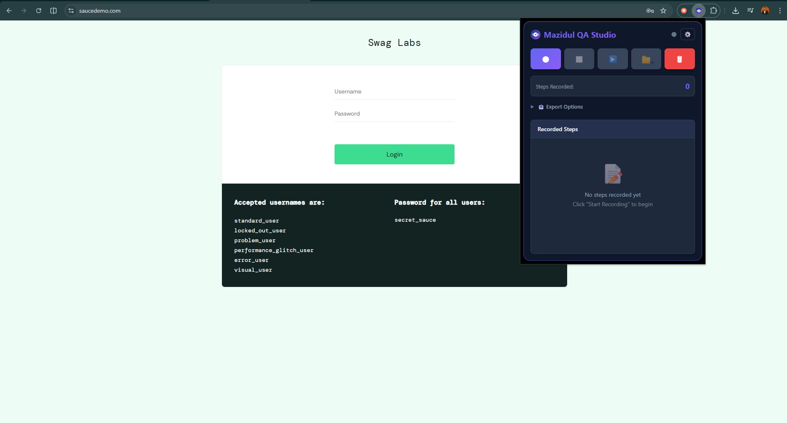
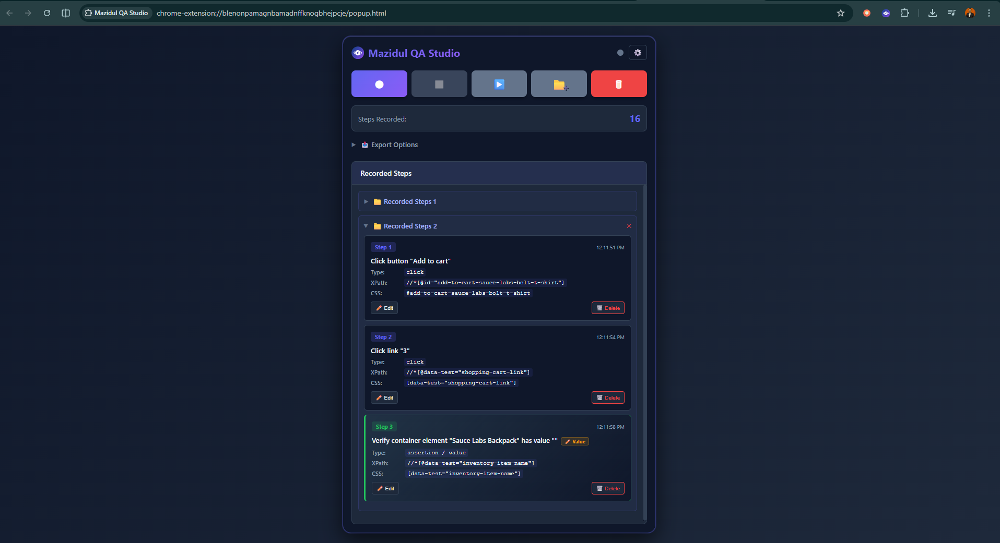
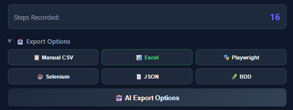
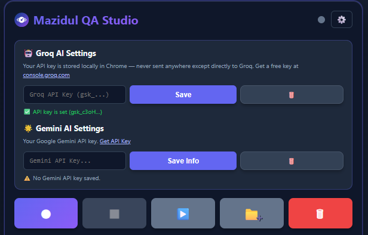
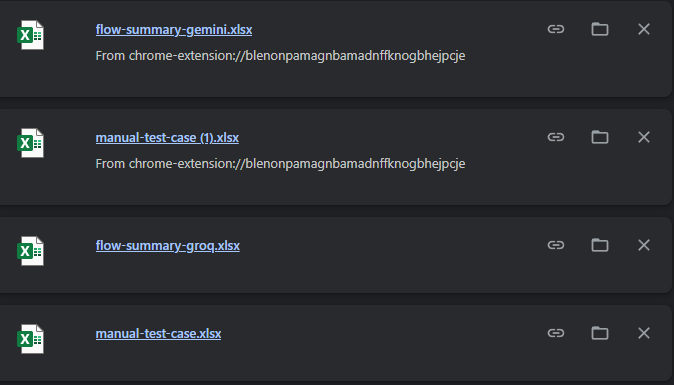
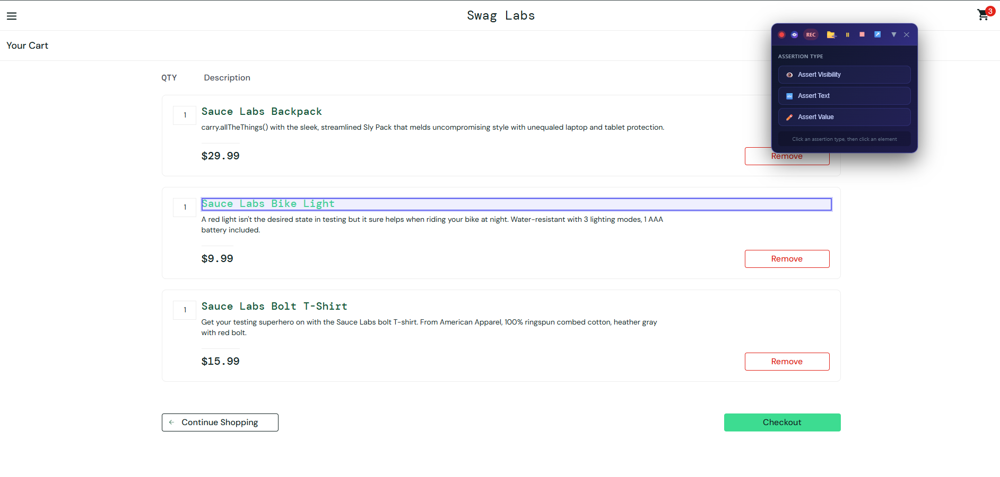

# Mazidul QA Studio

Mazidul QA Studio is a Manifest V3 Chrome extension for QA engineers and test automation developers. It records browser interactions, generates reliable selectors, and exports the captured flow into manual test cases, automation scripts, BDD scenarios, JSON, CSV, and Excel files.

Use it to move faster from exploratory testing to documented test cases and runnable automation starter code.

## Highlights

- Record clicks, inputs, changes, keyboard actions, scrolling, and navigation.
- Generate XPath, CSS, Playwright, and Selenium-friendly locators.
- View, edit, delete, clear, stop, and resume recorded steps from the popup.
- Export recorded flows as Manual CSV, Excel, Playwright, Selenium Java, JSON, and BDD/Gherkin.
- Generate AI-assisted flow summaries and structured QA steps with Groq or Gemini.
- Store recording state and API keys locally using Chrome extension storage.
- Run as an unpacked Chromium extension with Manifest V3.

## Screenshots

Add your project images to a `screenshots/` folder and update the file names below.

| Popup recorder | Recorded steps | Export options |
| --- | --- | --- |
|  |  |  |

| AI export settings | Generated output | Collapsible floating popup |
| --- | --- | --- |
|  |  |  |

Suggested screenshot files:

- `screenshots/popup-recorder.png`
- `screenshots/recorded-steps.png`
- `screenshots/export-options.png`
- `screenshots/ai-export-settings.png`
- `screenshots/generated-output.png`
- `screenshots/collapsible_floating_popup.png`

## Feature Overview

### Smart Recording

Mazidul QA Studio listens to user interactions on the active tab and turns them into structured test steps. It can capture common QA workflow actions such as clicking buttons, typing into fields, selecting values, navigating pages, and scrolling.

### Selector Generation

For each captured element, the extension generates multiple locator options so you can choose the strongest one for your automation stack:

- Absolute XPath
- Relative XPath
- Text-based XPath
- Attribute-based XPath
- CSS selectors
- Playwright locators such as `getByRole`, `getByText`, `getByLabel`, and `locator`
- Selenium locators such as `By.id`, `By.xpath`, and `By.cssSelector`

### Export Formats

Recorded flows can be exported in several formats:

- Manual test case CSV
- Excel workbook
- Playwright JavaScript test
- Selenium Java test
- JSON
- BDD/Gherkin feature file
- AI-generated flow summary as Excel
- AI-generated structured QA steps as Excel

### AI Assistance

The extension includes optional Groq and Gemini integrations. You can provide your own API keys in the popup settings, then generate clearer flow summaries or structured QA-style test steps from the recorded actions.

API keys are stored locally in Chrome storage and are used only when you trigger the related AI export action.

## Installation

1. Clone or download this repository.

   ```bash
   git clone <repository-url>
   cd Automation-Extension
   ```

2. Open Chrome or another Chromium-based browser.

3. Go to:

   ```text
   chrome://extensions/
   ```

4. Enable **Developer mode**.

5. Click **Load unpacked**.

6. Select the project folder.

7. Pin **Mazidul QA Studio** from the browser extensions menu for quick access.

## Usage

1. Open the website you want to test.
2. Click the Mazidul QA Studio extension icon.
3. Click **Start Recording**.
4. Perform the flow you want to capture.
5. Stop or resume recording as needed.
6. Review the recorded steps in the popup.
7. Edit or delete steps if needed.
8. Choose an export format and download the generated file.

## Example Exports

The repository includes sample outputs in the `examples/` folder:

- `examples/example-playwright.spec.js`
- `examples/RecordedTest.java`
- `examples/test.feature`
- `examples/manual-test-case.csv`

## Project Structure

```text
Automation-Extension/
+-- manifest.json              # Chrome extension Manifest V3 configuration
+-- popup.html                 # Extension popup markup
+-- popup.css                  # Popup styling
+-- popup.js                   # Popup controls, rendering, and export triggers
+-- background.js              # Service worker and message routing
+-- content.js                 # Page-level event capture and highlighting
+-- selectorEngine.js          # XPath, CSS, Playwright, and Selenium locator logic
+-- exporter.js                # Export generation for supported formats
+-- groq.js                    # Groq AI integration
+-- gemini.js                  # Gemini AI integration
+-- xlsx.full.min.js           # SheetJS library for Excel export
+-- icons/                     # Extension icons
+-- examples/                  # Sample generated files
+-- screenshots/               # Add README screenshots here
```

## Architecture

```text
Popup UI
  |
  | start, stop, resume, clear, export
  v
Background service worker
  |
  | injects scripts and stores state
  v
Content script
  |
  | captures browser events
  v
Selector engine
  |
  | creates locators
  v
Exporter / AI modules
  |
  | downloads generated output
  v
CSV, Excel, Playwright, Selenium, JSON, BDD
```

## Permissions

The extension uses these Chrome permissions:

- `activeTab` for interacting with the current browser tab.
- `storage` for saving recorded steps, recording state, and optional API keys.
- `scripting` for injecting recorder scripts into web pages.
- `tabs` for tab-level communication and state handling.
- `<all_urls>` host permission so the recorder can work across websites.

## Browser Support

Mazidul QA Studio is designed for Chromium-based browsers:

- Google Chrome
- Microsoft Edge
- Brave
- Other Manifest V3 compatible Chromium browsers

## Known Limitations

- Browser-internal pages such as `chrome://` cannot be recorded.
- Events inside iframes may not always be captured.
- Shadow DOM-heavy applications may need manual selector refinement.
- Generated automation is intended as a strong starting point; assertions and data setup may still need manual refinement.

## Roadmap Ideas

- Screenshot capture per recorded step.
- Video recording for full sessions.
- Assertion generation.
- Selector preference settings.
- Test grouping and suite management.
- Import and replay recorded flows.

## License

This project is provided as-is for educational and professional use.
